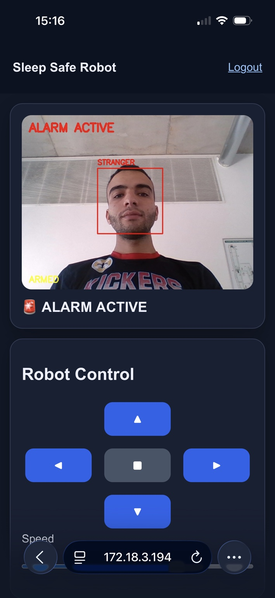
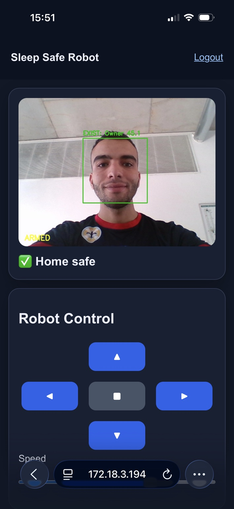
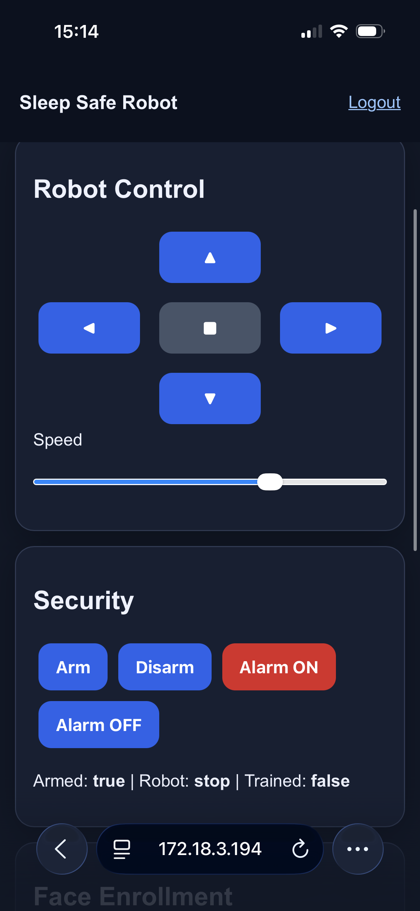
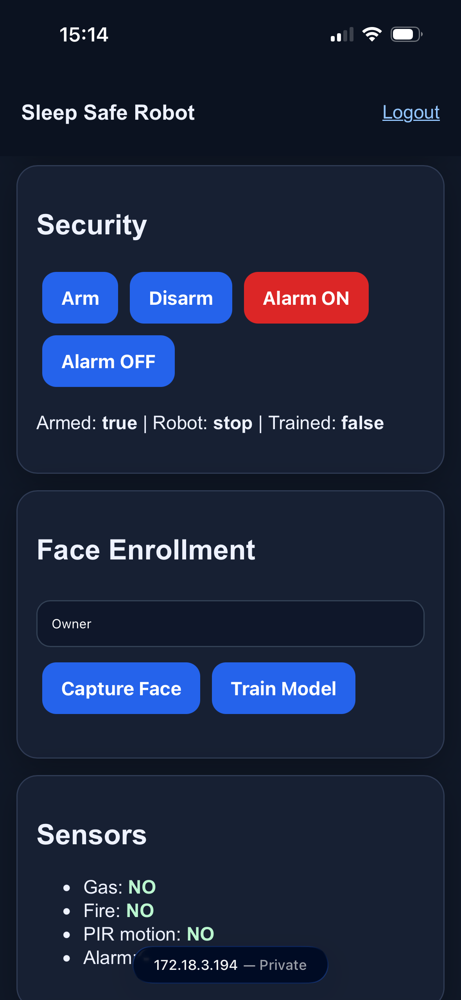
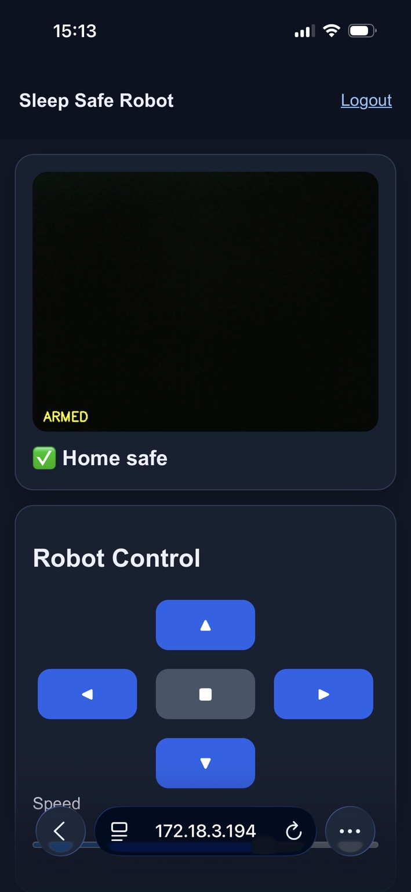
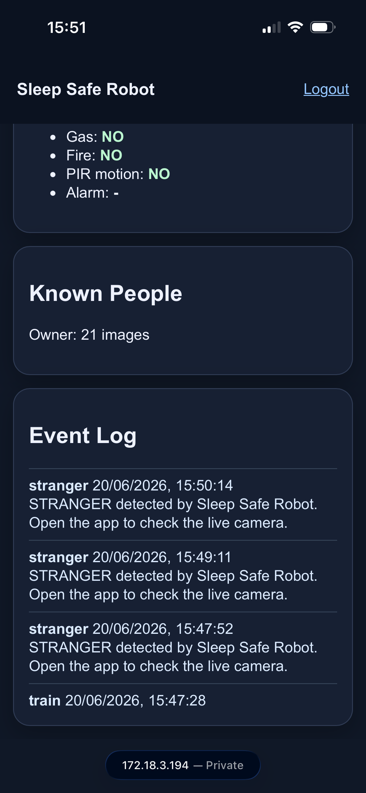

# Rolarm AI Surveillance Robot

An AI-powered smart home security robot built with Raspberry Pi, Computer Vision, and IoT technologies.

## Features

- Real-time Face Recognition
- Stranger Detection & Alarm Activation
- Mobile Robot Control
- Live Camera Streaming
- Face Enrollment & Training
- Fire & Gas Detection
- Motion Detection (PIR)
- Event Logging System
- Mobile-Friendly Dashboard

---

## Screenshots

### 🚨 Intruder Detection & Alarm Activation



Detects unknown individuals and automatically activates the alarm system.

---

### ✅ Authorized User Recognition



Recognizes registered family members and confirms a safe status.

---

### 🎮 Robot Control Dashboard



Control robot movement remotely using a mobile-friendly interface.

---

### 👤 Face Enrollment & Model Training



Register new users and train the recognition model directly from the dashboard.

---

### 📊 Sensor Monitoring



Monitor fire, gas, and motion sensors in real time.

---

### 📝 Event Logging System



Track security events and system alerts with timestamps.

---

## Technology Stack

- Python
- Flask
- OpenCV
- SQLite
- Raspberry Pi
- HTML/CSS/JavaScript
- L298N Motor Driver
- PIR Motion Sensor
- MQ Gas Sensor
- Flame Sensor

---

## Installation

```bash
git clone https://github.com/Ahmed-Gonga/Rolarm-AI-Surveillance-Robot.git
cd Rolarm-AI-Surveillance-Robot

python3 -m venv venv
source venv/bin/activate

pip install -r requirements.txt
python3 main.py

## Access

Open the application locally:

```text
http://localhost:5000
```

Or from a device connected to the same network:

```text
http://<RASPBERRY_PI_IP>:5000
```

## Project Purpose

This project was developed as an extension and enhancement of a smart home security graduation project concept. The objective is to integrate robotics, computer vision, IoT sensing, and mobile accessibility into a unified security platform capable of monitoring homes and notifying owners of potential threats or hazards.

## Future Improvements

* Deep-learning based face recognition
* Cloud synchronization
* Mobile native application
* Autonomous navigation
* Object detection
* Multi-camera support
* Voice assistant integration

## License

This project is intended for educational, research, and prototyping purposes.

## Author

Ahmed Wahba

- GitHub: https://github.com/Ahmed-Gonga
- LinkedIn: https://linkedin.com/in/ahmedhwahba
